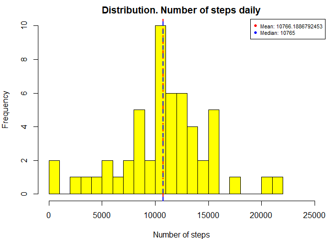
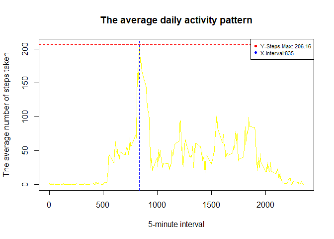
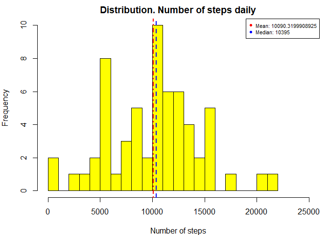
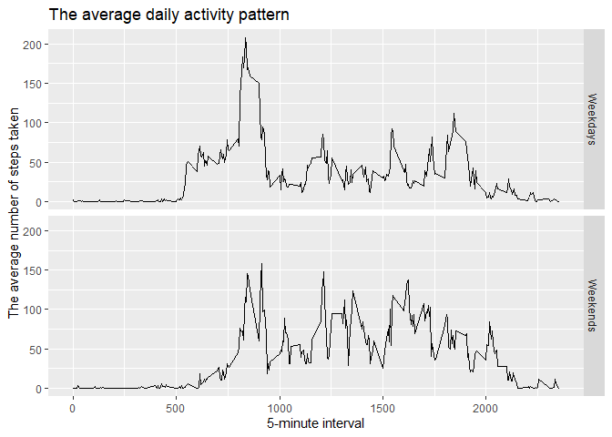

## Loading and preprocessing the data  

```r
library(dplyr)
```

```
## 
## Attaching package: 'dplyr'
```

```
## The following objects are masked from 'package:stats':
## 
##     filter, lag
```

```
## The following objects are masked from 'package:base':
## 
##     intersect, setdiff, setequal, union
```

```r
steps <- read.csv("./activity.csv", sep=",", header=TRUE)  
steps <- na.omit(steps)  
steps$date <- as.Date(steps$date)  
by_day <- group_by(steps, date)  
steps_daily <- summarize(by_day, steps=sum(steps))  
```

## What is mean total number of steps taken per day?  

```r
par(mar=c(4,4,2,1))  
hist(steps_daily$steps, breaks=30, xlab="Number of steps", ylab = "Frequency", main = "Distribution. Number of steps daily", col="yellow", xlim=c(0, 25000))  
abline(v= mean(steps_daily$steps, na.rm = TRUE), lwd=2, lty=4, col="red")  
abline(v= median(steps_daily$steps, na.rm = TRUE), lwd=2,lty=2,col="blue")  
m <- paste("Mean:",mean(steps_daily$steps, na.rm = TRUE))  
md <- paste("Median:",median(steps_daily$steps, na.rm = TRUE))  
legend("topright", cex=0.7, pch=c(16,16),col=c("red", "blue"), legend=c(m, md))  
```

<!-- -->

```r
print(paste(m, " ", md))  
```

```
## [1] "Mean: 10766.1886792453   Median: 10765"
```

## What is the average daily activity pattern?  

```r
library(dplyr) 
by_interval <- group_by(steps, interval)  
steps_interval <- (summarize(by_interval, steps=mean(steps)))  
plot(steps_interval$interval, steps_interval$steps, type = "l", xlab = "5-minute interval", ylab = "The average number of steps taken", main = "The average daily activity pattern", col="Yellow")  
abline(v= 835, lwd=1,lty=2,col="blue")  
abline(h= max(steps_interval$steps, na.rm = TRUE), lwd=1,lty=2,col="red")  
legend("topright", cex=0.7, pch=c(16,16),col=c("red", "blue"), legend=c("Y-Steps Max: 206.16", "X-Interval:835"))  
```

<!-- -->

```r
print("The 5-minute interval which on average across all the days in the dataset, contains the maximum number of steps:")  
```

```
## [1] "The 5-minute interval which on average across all the days in the dataset, contains the maximum number of steps:"
```

```r
steps_interval[steps_interval$steps==max(steps_interval$steps),]  
```

```
## # A tibble: 1 x 2
##   interval steps
##      <int> <dbl>
## 1      835  206.
```

## Imputing missing values  

```r
raw_data <- read.csv("./activity.csv", sep=",", header=TRUE)  
print("The total number of rows with Nas")  
```

```
## [1] "The total number of rows with Nas"
```

```r
sum(is.na(raw_data))  
```

```
## [1] 2304
```

```r
library(impute)  
raw_data$date <- as.numeric(as.Date(raw_data$date))  
raw_data_imputed <-  as.data.frame(impute.knn(as.matrix(raw_data))$data)
```

```
## Cluster size 17568 broken into 8722 8846 
## Cluster size 8722 broken into 4339 4383 
## Cluster size 4339 broken into 2274 2065 
## Cluster size 2274 broken into 282 1992 
## Done cluster 282 
## Cluster size 1992 broken into 857 1135 
## Done cluster 857 
## Done cluster 1135 
## Done cluster 1992 
## Done cluster 2274 
## Cluster size 2065 broken into 874 1191 
## Done cluster 874 
## Done cluster 1191 
## Done cluster 2065 
## Done cluster 4339 
## Cluster size 4383 broken into 2187 2196 
## Cluster size 2187 broken into 1150 1037 
## Done cluster 1150 
## Done cluster 1037 
## Done cluster 2187 
## Cluster size 2196 broken into 1098 1098 
## Done cluster 1098 
## Done cluster 1098 
## Done cluster 2196 
## Done cluster 4383 
## Done cluster 8722 
## Cluster size 8846 broken into 4392 4454 
## Cluster size 4392 broken into 2195 2197 
## Cluster size 2195 broken into 975 1220 
## Done cluster 975 
## Done cluster 1220 
## Done cluster 2195 
## Cluster size 2197 broken into 914 1283 
## Done cluster 914 
## Done cluster 1283 
## Done cluster 2197 
## Done cluster 4392 
## Cluster size 4454 broken into 2196 2258 
## Cluster size 2196 broken into 1343 853 
## Done cluster 1343 
## Done cluster 853 
## Done cluster 2196 
## Cluster size 2258 broken into 1337 921 
## Done cluster 1337 
## Done cluster 921 
## Done cluster 2258 
## Done cluster 4454 
## Done cluster 8846
```

```r
raw_data_imputed$date <- as.Date(raw_data_imputed$date, origin = "1970-01-01")  
by_day_2 <- group_by(raw_data_imputed, date)  
steps_daily_2 <- summarize(by_day_2, steps=sum(steps))  

par(mar=c(4,4,2,1))  
hist(steps_daily_2$steps, breaks=30, xlab="Number of steps", ylab = "Frequency", main = "Distribution. Number of steps daily", col="yellow", xlim=c(0, 25000))  
abline(v= mean(steps_daily_2$steps, na.rm = TRUE), lwd=2, lty=4, col="red")  
abline(v= median(steps_daily_2$steps, na.rm = TRUE), lwd=2,lty=2,col="blue")  
m2 <- paste("Mean:",mean(steps_daily_2$steps, na.rm = TRUE))  
md2 <- paste("Median:",median(steps_daily_2$steps, na.rm = TRUE))  
legend("topright", cex=0.7, pch=c(16,16),col=c("red", "blue"), legend=c(m2, md2))  
```

<!-- -->

```r
print(paste("before imputing: ",m, " ", md))  
```

```
## [1] "before imputing:  Mean: 10766.1886792453   Median: 10765"
```

```r
print(paste("after imputing: ",m2, " ", md2))  
```

```
## [1] "after imputing:  Mean: 10090.3199908925   Median: 10395"
```

## Are there differences in activity patterns between weekdays and weekends?  

```r
steps2 <- raw_data_imputed  
library(lubridate) 
```

```
## Warning: package 'lubridate' was built under R version 4.0.5
```

```
## 
## Attaching package: 'lubridate'
```

```
## The following objects are masked from 'package:base':
## 
##     date, intersect, setdiff, union
```

```r
library(ggplot2)
```

```
## Warning: package 'ggplot2' was built under R version 4.0.4
```

```r
steps2$weektype <- ifelse(wday(steps2$date, label = TRUE) %in% c("lu\\.","ma\\.","mi\\.","ju\\.","vi\\." ),"Weekdays","Weekends")  
by_interval_weektype <- group_by(steps2, interval, weektype)  
steps_interval_weektype <- (summarize(by_interval_weektype, steps=mean(steps), weektype=weektype))   
```

```
## `summarise()` has grouped output by 'interval', 'weektype'. You can override using the `.groups` argument.
```

```r
qplot(interval, steps,data=steps_interval_weektype, facets=weektype~.,geom="line" , xlab = "5-minute interval", ylab = "The average number of steps taken", main = "The average daily activity pattern")  
```

<!-- -->

*It is observed:*  
*Max Weekdays: x= 835 y= 207. Mean= 33.36489*  
*Max Weekends: x= 915 y= 153. Mean= 40.02226*  
*More activity during the weekends in contrast to the weekdays.*  

*end/final*
